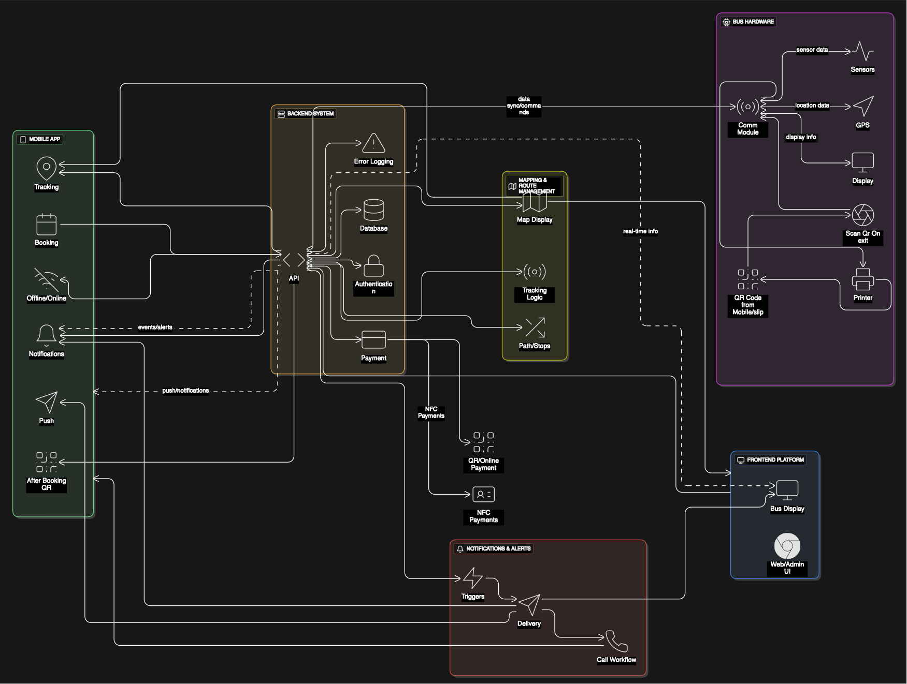

# smart-bus-system

A application of Smart Bus System. explain everything included like bus hardware, backend, mobile and everything

## Structure

```
smart-bus-system/
├── backend/        # Django + uvicorn/uv
├── frontend/       # React
├── app/            # Flutter
└── README.md
```

## Diagram



This diagram illustrates the overall architecture and components of the Smart Bus System, showing the interaction between the bus hardware, backend services, and the mobile application.

## Getting Started

### Backend
```bash
cd backend
python -m venv venv
source venv/bin/activate
pip install -r requirements.txt
uvicorn myproject.asgi:application --reload
```

### Frontend (Still in development)
```bash
cd frontend
npm install
npm start
```

### App (Still in development)
```bash
cd app
flutter pub get
flutter run
```
